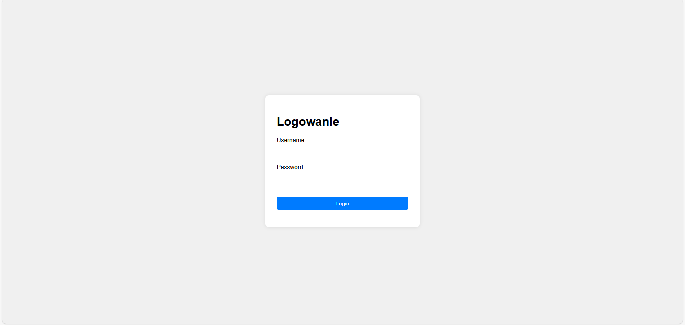
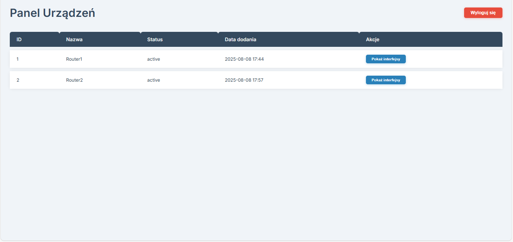

# 🌐📡 network-config-web
Web app parsing XML device configs using flask and SQLite.
## Project Structure
- network-config-web/
- │
- ├── app/
- │ ├── init.py # Flask app initialization
- │ ├── extensions.py # Extensions initialization (SQLAlchemy)
- │ ├── forms.py # WTForms forms
- │ ├── models.py # SQLAlchemy models
- │ ├── routes.py # Flask routes
- │ ├── static/ # Static files (CSS)
- │ └── templates/ # HTML templates
- │
- ├── run.py # Application entry point
- ├── requirements.txt # Python dependencies list
- ├── bugtracker.db # SQLite database file.
- ├── xml_watcher.py # Likely a script to monitor folder with xml files 
- └── xml_files # Folder with xml files
## ⚙️ Installation and running
 ```bash   
# 1️⃣ Clone the repository
git clone https://github.com/MatNycz/bug-tracker-flask.git

# 2️⃣ Enter the project directory
cd network-config-web

# 3️⃣ Create and activate virtual environment
python -m venv venv
source venv/bin/activate  # Linux/Mac
venv\Scripts\activate     # Windows

# 4️⃣ Install required packages
pip install -r requirements.txt

# 5️⃣ Run the application
flask run
python xml_watcher.py
```
## 🛠 Technologies:
- Python 3.x – Programming language
- Flask 3.1.1 – Web framework
- Flask-Login – User authentication and authorization
- Flask-WTF – Form handling and validation
- Flask-Migrate + Alembic – Database migrations
- Flask-SQLAlchemy + SQLAlchemy – ORM and database management
- Jinja2 – HTML templating engine
- SQLite – Database
## 📸 Screenshots

### login


### main page


### main page with interface


